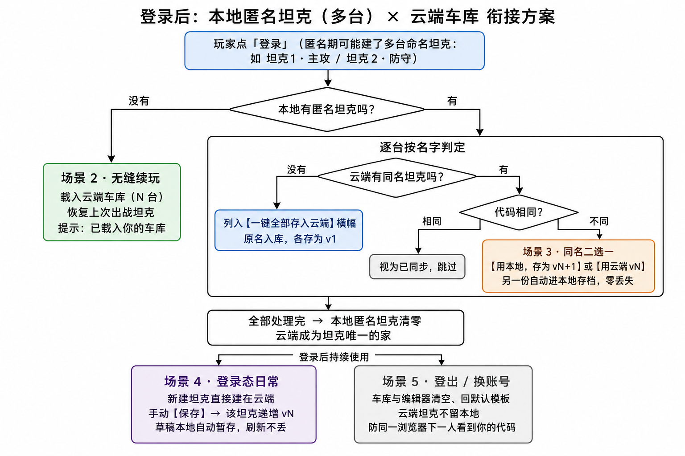

# 登录后：本地匿名坦克（多台）× 云端车库 衔接体验方案 v2（待用户确认）



> 状态：**v2 多坦克重设计已定稿、等待用户确认口径；未获确认前不实现。**
> 修订：2026-08-13（北京时间）。v1（单坦克版）经用户反馈重设计：玩家期望拥有多台坦克（如「坦克1·主攻」「坦克2·防守」），每台可自己命名。
> 设计原则（一句话）：**云端是坦克唯一的家；本地坦克只在匿名期临时存在；登录那一刻按「名字」逐台衔接——同名走二选一，无同名一键入库；任何情况下不丢用户任何一份代码。**

## 多坦克模型（核心变化）

- **每个玩家可拥有多台坦克**，每台有玩家自己起的名字（默认「坦克1」「坦克2」……，可重命名；同一玩家内名字唯一）。
- **云端是坦克的家**：登录态下新建的坦克一律直接建在云端；云端坦克一直在云端，不会「搬回本地」。
- **本地坦克只在匿名（未登录）期产生**：匿名期也可以建多台、命名多台；登录时刻是它们「上户口」进云端的唯一时机。
- **UI 新增「我的车库」面板**：列出云端坦克（名字 + vN），当前出战坦克高亮（`is_active`），支持切换 / 新建 / 重命名。
- 数据事实（已核对现状代码）：`schema.json` 的 Tank 实体已有 `name` / `version` / `is_active` 字段，每行一台坦克，**云端 schema 无需改动**；要改的是前端——`web/play.js` 现在只取最后一行当唯一 `myTank`，本地 `agentank.save` 只存一份 `{code,v,n}`。

## 五个场景

### 场景 1 · 匿名期建了 1~N 台坦克 → 登录（入库时刻）

- 登录成功瞬间，逐台按**名字**判定，汇成一条横幅：
  - 云端**无同名** → 列入「一键全部存入云端」清单：
    > 🎉 检测到你本地的 2 台坦克（坦克1·主攻、坦克2·防守）。**【一键全部存入云端】**
    > 点一下：各台保留原名入库，各存为该坦克 v1。
  - 云端**有同名**且代码相同 → 视为已同步，静默跳过，不打扰。
  - 云端**有同名**且代码不同 → 该台走场景 3 二选一。
- 全部处理完：**本地匿名坦克清零**，云端成为唯一的家。
- 不点也不阻塞：横幅不挡操作，随时可点；未入库前继续开战照常（战绩仍按匿名局计）。

### 场景 2 · 登录时本地无匿名坦克

- 什么都不用做：自动载入云端车库，恢复上次出战坦克（`is_active`），提示「已载入你的车库（N 台）」。
- 这就是换新设备登录的体验：登上来立刻是自己的整个车库。

### 场景 3 · 同名坦克冲突（逐台，绝不静默覆盖）

- 出一条二选一横幅（每台一条，逐台确认）：
  > 本地的「坦克1·主攻」与云端 v3 不同：**【用本地，存为 v4】** / **【用云端 v3】**
- 无论选哪个，另一份都自动进本地存档（现有 vN 存档机制），随时找回，零丢失。

### 场景 4 · 登录态日常（所有新坦克都在云端）

- **新建坦克 → 直接建在云端**（不再产生本地坦克），命名即入库。
- 改代码 → 手动点**【保存】**→ 该台坦克递增 vN。不做自动上传（避免半成品覆盖云端），但草稿本地自动暂存（草稿≠本地坦克，只是断电保护），刷新不丢。
- 车库内切换出战坦克 → 更新 `is_active`，编辑器载入该台最新版。

### 场景 5 · 登出 / 换账号

- 登出时车库与编辑器**清空、回默认模板**（你的坦克都在云端 + 本地存档，不丢），云端坦克不留本地，避免同一浏览器下一个登录的人看到上一个人的代码。
- 登出后进入新的匿名期：此后新建的又是本地坦克，下次登录再走场景 1 入库。

## 判定逻辑（登录时刻）

```
登录成功
├─ 本地无匿名坦克 ──────────→ 场景 2（载入云端车库，恢复 is_active 出战坦克）
└─ 本地有匿名坦克（1~N 台），逐台按名字判定：
   ├─ 云端无同名 ──→ 列入「一键全部存入云端」横幅（原名入库，各存 v1）
   └─ 云端有同名
      ├─ 代码相同 ──→ 视为已同步，跳过
      └─ 代码不同 ──→ 场景 3 二选一（另一份进本地存档）
全部处理完 → 本地匿名坦克清零，云端成为坦克唯一的家
```

## 明确不在本方案范围

1. 匿名期战绩：登录后不自动补传/合并；匿名局无本地历史列表（阅后即焚）——此前确认窗口超时未答，维持现状。
2. 本地存档 `agentank.save` 不分账号的历史包袱（场景 5 只解决编辑器/车库串号，不迁移旧存档）——同上，维持现状。
3. 创作工坊内容云同步：已在早前一轮实现（登录后旧本地数据一次性搬上云，`web/app.js`），不属本方案。

## 确认后实现的入口清单（供动工时参考）

- `web/play.js`：`myTank` 单例 → 车库列表（按 `name` 分组、每台取最新版）；登录时刻三分支判定 + 入库/二选一横幅；「保存」按当前出战坦克递增 vN；新建坦克登录态直建云端。
- 本地匿名存储：`agentank.save` 从单份 `{code,v,n}` 升级为坦克列表 `[{name,code,skill,v}]`，带旧格式一次性迁移（旧单份 → 「坦克1」）。
- `web/index.html` + `web/app.js`：「我的车库」面板（列表/切换/新建/重命名）；登出清空车库与编辑器。
- `web/i18n.js`：新增车库与横幅文案 zh/en 双语。
- 云端：Tank 实体字段不动；补「同一玩家内 name 唯一」的前端校验。
- 闸门照常：`npm test` → `node scripts/build-web.mjs` → `node scripts/check-dist.mjs` 全 PASS 才提交；发布走 AgenTank 发布手册标准循环。
